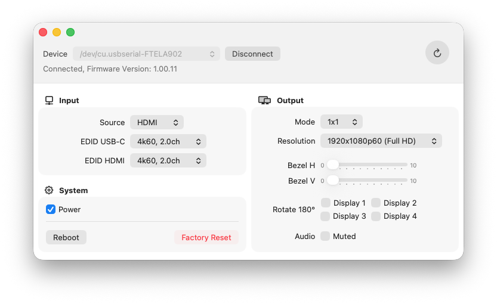

# Video Wall Utility

macOS utility to control the DS-55358 / HDC-TWB14 video wall controller via its serial interface. Implements all
settings mentioned in the [manual](https://ftp.assmann.com/pub/DS-/DS-55358___4016032501961/DS-55358_qig_en_English_20250410.pdf),
tested with firmware version 1.00.11.



## Using the App

You can find the built app in the GitHub releases. Note that the build is currently not signed, so you may need to
remove the attribute to run it without warnings from macOS:

```
xattr -rd com.apple.quarantine "Video Wall Utility.app"
```

Connect the video wall controller via RS-232 as instructed in the manual, select the serial port at the top of the
application and click "Connect". The app will attempt to read all parameters from the controller. Afterward, the
settings can be changed in the UI.
